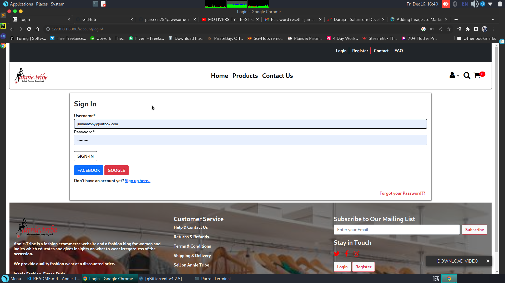
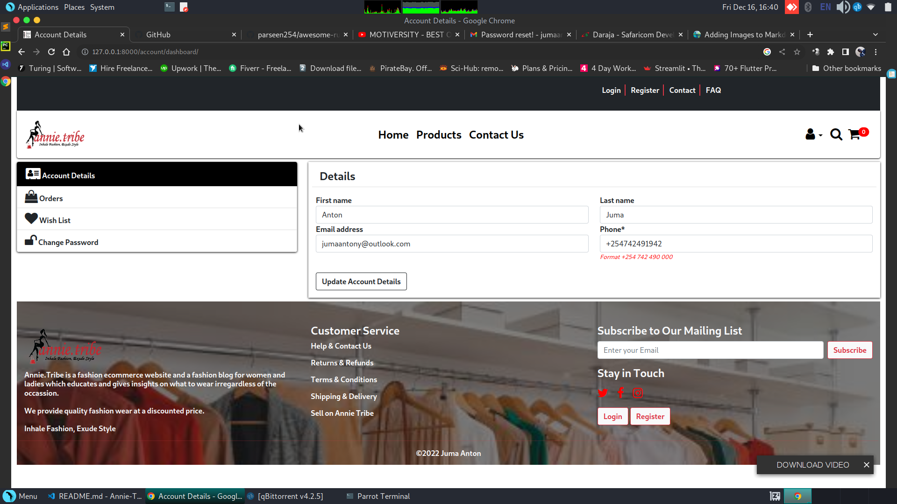
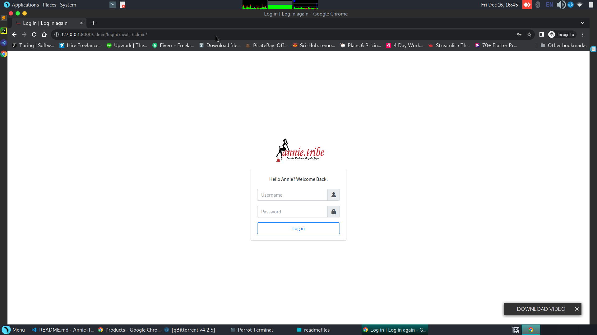
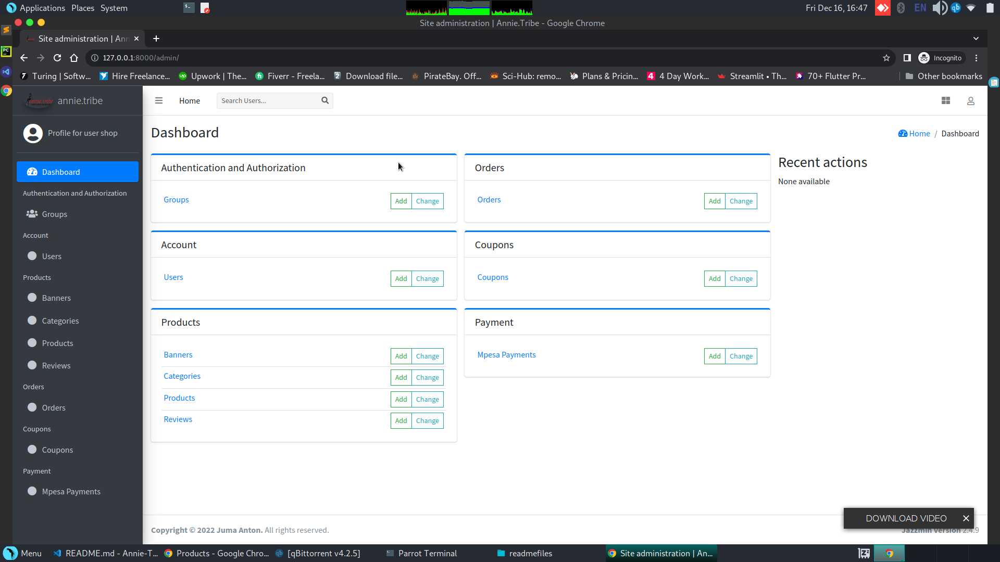
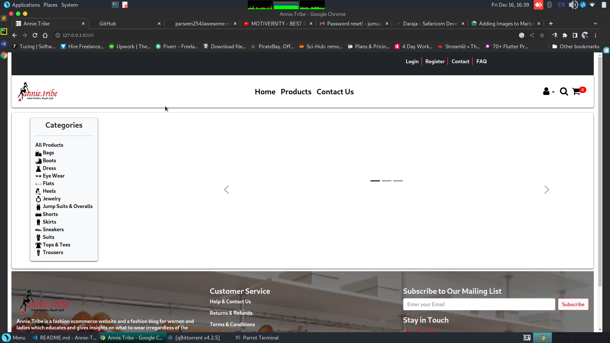
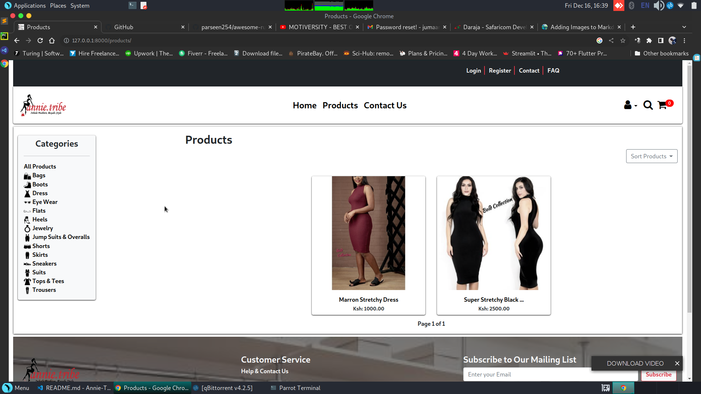
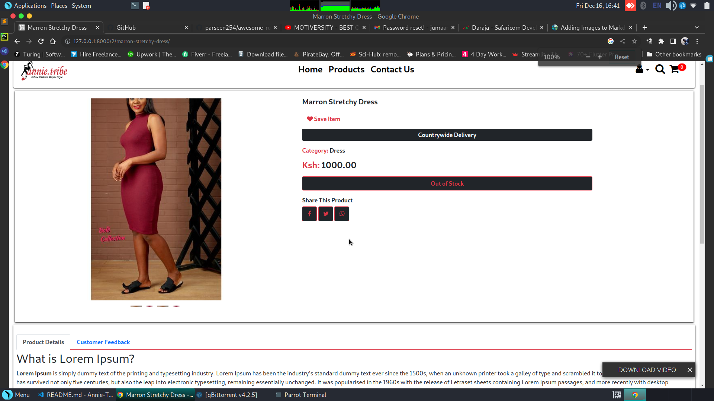
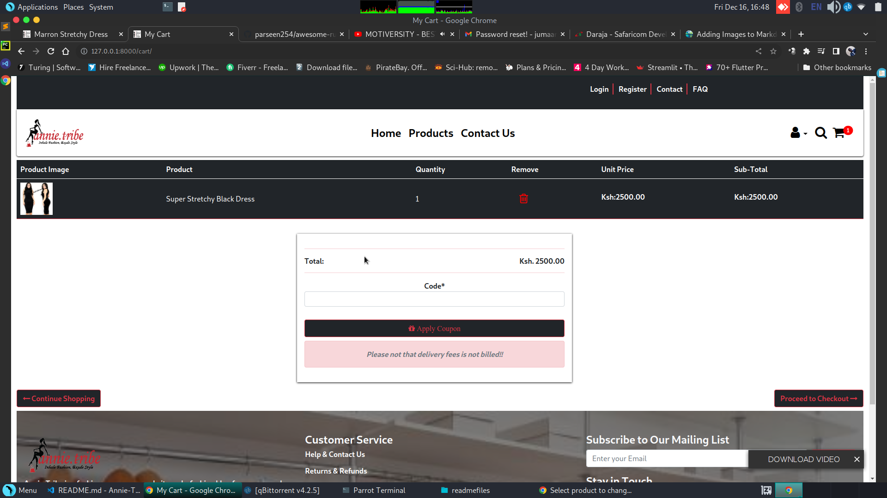
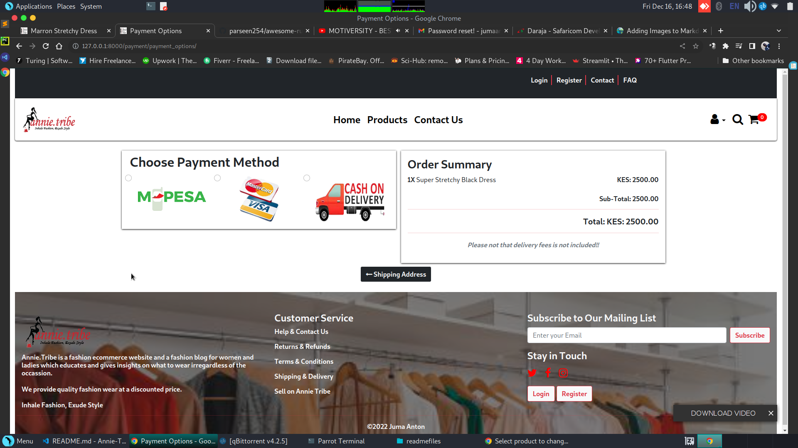
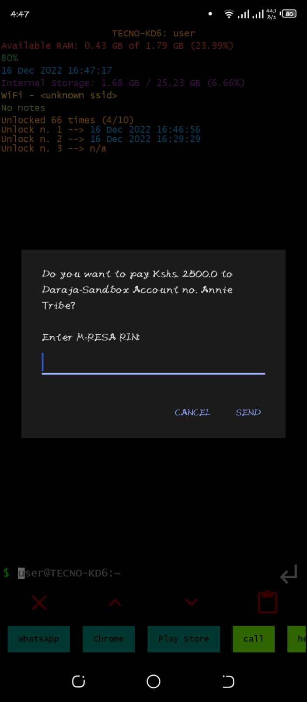

# **Annie-Tribe** 

**E-commerce Website developed with the following technologies:**

* Python
* Django
* JS
* HTML
* CSS

**Other Integrations Include:**
* Mpesa Payment (Daraja Api)
* Card Payment (Barintree Api)
* Twilio Phone Verify
* Mailchimp Mail Marketting

The project has 
* An authentication system
* Product catalog that allows users to filter products based on the category and sort products based on price
* A phone verification system using twilio verify
* A cart system that allows users to add and remove products from the cart
* A coupon system that allows discounts
* Payment Options mentioned above
* 

## **Pages**

## **Login Page**

## **Account Details**

## **Admin Login Page**

## Admin Dashboard customized with django-jazzmine

## **Home Page**

## **Products Page**

## **Products Detail**

## **Cart**

## **Payment Options**

## **Mpesa Stk Prompt**

